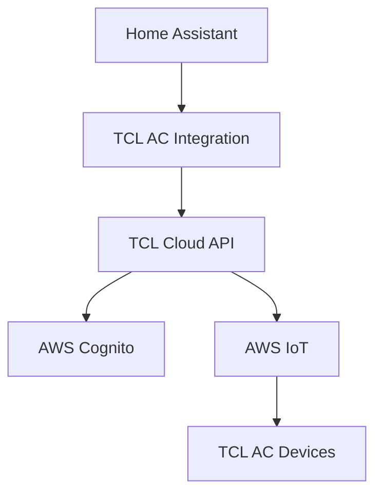

# TCL AC Integration - System Patterns

## Architecture Overview

## Authentication Flow
1. Email/password auth with TCL account API
2. Get SSO token
3. Exchange SSO for SaaS and Cognito tokens
4. Get AWS credentials using Cognito token

## Device Control Flow
1. Get device list from TCL API
2. Control devices via AWS IoT MQTT topics
3. Commands signed with AWS credentials

## Key Components
- `config_flow.py`: Handles setup and authentication
- `api.py`: Manages all API interactions
- `climate.py`: Home Assistant climate platform implementation
- `const.py`: Centralized constants

## Error Handling
- Separate error classes for auth vs API errors
- Logging at appropriate levels
- User-friendly error messages in config flow
